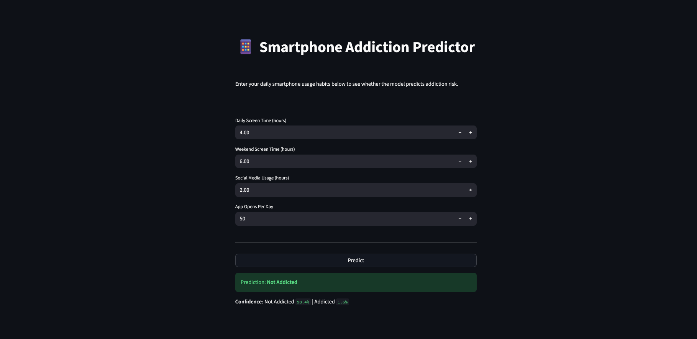

# Smartphone Addiction Classifier

> A logistic regression classifier that predicts smartphone addiction risk based on daily usage habits — deployed as an interactive Streamlit web app.

**Live demo:** [ml-webapp-project-1.onrender.com](https://ml-webapp-project-1.onrender.com/)

---

## Problem

Smartphone overuse has become a growing public health concern, but most people have no way to objectively assess whether their habits put them at risk. This project builds a binary classifier that takes simple self-reported usage metrics — screen time, app opens, social media hours — and predicts whether a user's behavior pattern is consistent with smartphone addiction. The goal is to make that signal accessible through a clean, interactive interface anyone can use.

## Dataset

- **Source:** [Kaggle — Smartphone Usage & Addiction Analysis](https://www.kaggle.com/) *(update with direct dataset link)*
- **Size:** 7,500 rows × 15 columns
- **Target:** `addicted_label` (0 = Not Addicted, 1 = Addicted)
- **Key features:** `daily_screen_time_hours`, `weekend_screen_time`, `social_media_hours`, `app_opens_per_day`, `gaming_hours`, `sleep_hours`, `notifications_per_day`, `stress_level`, `academic_work_impact`

## Approach

1. **EDA (10 steps):** Explored distributions, correlations, and class balance. Noted the dataset is synthetically generated — all features are near-uniformly distributed, which limits real-world generalizability but still allows the model to learn meaningful patterns.
2. **Feature analysis:** Built correlation heatmaps and boxplots of each feature vs. the target. `daily_screen_time_hours` (r = 0.58) and `weekend_screen_time` (r = 0.56) emerged as the strongest predictors. Categorical features (gender, stress level) showed near-zero correlation.
3. **Feature engineering:** Ordinal-encoded `stress_level` and `academic_work_impact`, one-hot encoded `gender`, applied `StandardScaler` to all numeric features.
4. **Feature selection:** Used `SelectKBest` with chi-square scoring — confirmed that screen time and social media hours drive the signal.
5. **Modeling:** Trained a Logistic Regression with ElasticNet penalty (`solver=saga`). Used 5-fold `GridSearchCV` over `C`, `l1_ratio`, and `class_weight`, optimizing for ROC-AUC.
6. **Deployment:** Serialized the trained model and scaler with `pickle`, then built a Streamlit app that accepts user inputs and returns a prediction with confidence probabilities.

## Results

The final model was selected via 5-fold cross-validation optimizing ROC-AUC. `daily_screen_time_hours` and `weekend_screen_time` carry the largest positive coefficients — consistent with the EDA. The Streamlit app displays a confidence split (e.g., "Not Addicted: 63% | Addicted: 37%") alongside each prediction, making the output transparent rather than just a label.

## Tech stack

`Python` · `pandas` · `NumPy` · `scikit-learn` · `Streamlit` · `SQLite` · `Matplotlib` · `Seaborn` · `pickle`

## Run it locally

```bash
git clone https://github.com/matthewkane-ml/ML_WebApp_MTK.git
cd ML_WebApp_MTK
pip install -r requirements.txt

# Run EDA + model training first
python src/ML_WebAPP.py

# Launch the Streamlit app
streamlit run src/streamlit_app.py
```

## Screenshots



## What I'd do next

- Train on real-world data (e.g., iOS Screen Time or Android Digital Wellbeing exports) to improve validity beyond synthetic data
- Add SHAP explainability so users can see which specific habit is driving their risk score
- Experiment with tree-based models (Random Forest, XGBoost) to capture non-linear interactions between features

---

**Author:** Matthew Kane — [LinkedIn](https://www.linkedin.com/in/thomas-kane-392094410/) · [GitHub portfolio](https://github.com/matthewkane-ml)
